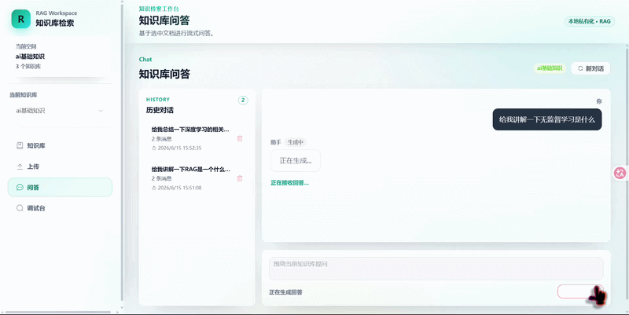
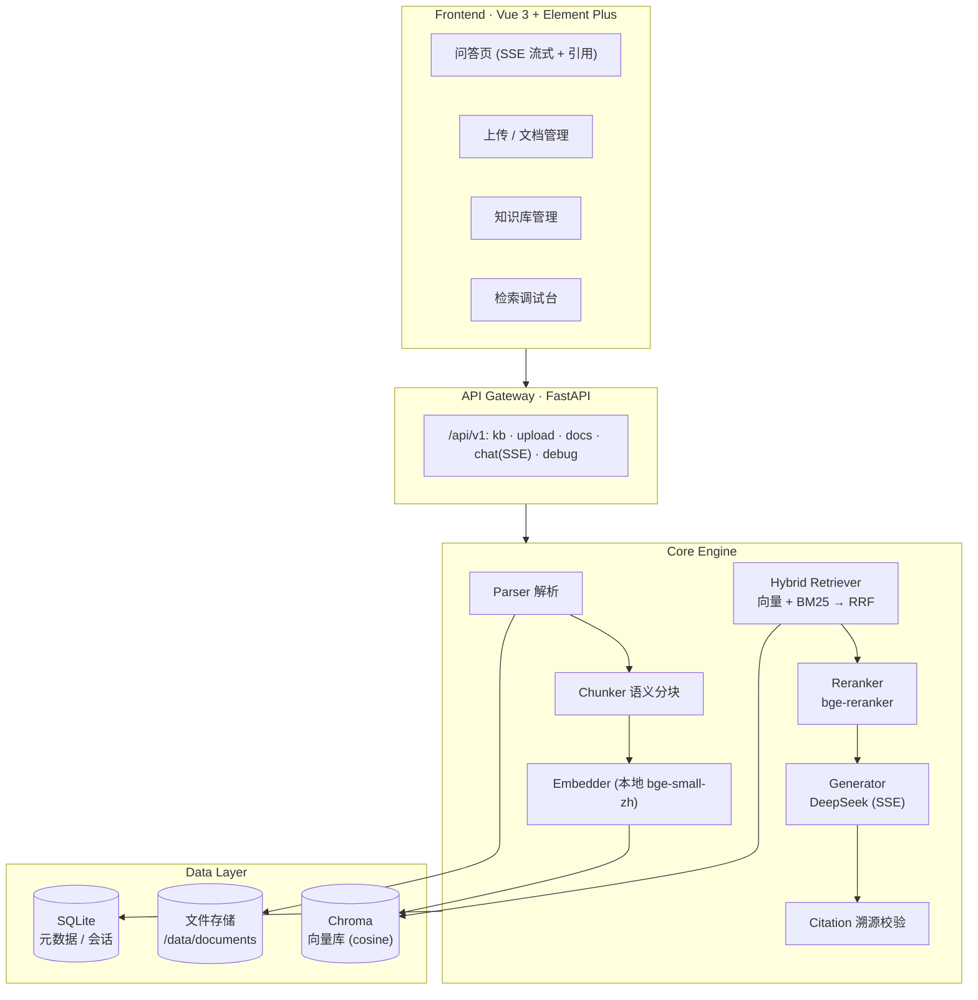

# RAG QA System · 智能知识库问答系统

> An end-to-end Retrieval-Augmented Generation (RAG) knowledge-base Q&A system: upload documents, ask questions in natural language, and get **streaming answers with verifiable citations**.
>
> 一套端到端的 RAG 知识库问答系统:上传文档 → 自然语言提问 → 得到**带可溯源引用的流式回答**。检索链路覆盖语义分块、向量 + BM25 混合召回、RRF 融合、交叉编码器精排与引用幻觉校验。

<!-- 把录好的 Demo GIF 放这里 / Put your demo GIF here -->
<!--  -->

---

## ✨ Highlights / 核心亮点

- **三策略自适应语义分块** — 结构感知(Markdown 标题 / 段落)+ 段落贪心合并 + 滑窗兜底,全程保留 `start_pos/end_pos` 供引用溯源。
- **混合检索 + RRF 融合 + 交叉编码精排** — 向量(语义)与 BM25(字面)双路召回,RRF 排名融合,再用 `bge-reranker` 精排。**自建 30 题评测集上 Recall@5 由 53.3% → 90.0%**。
- **流式问答 + 引用溯源** — SSE 逐字输出;`DOMPurify` 清洗 Markdown(防 XSS);`[1][2]` 引用可点击查看原文,并对幻觉引用做校验过滤。
- **本地中文嵌入,可私有化** — 默认使用本地 `bge-small-zh`(fastembed),无需把文档发往外部;LLM 走 OpenAI 兼容协议,可热插拔。
- **多轮对话 + 可中断生成** — 会话历史续接;支持流式中"停止生成"与失败"重试"。
- **检索调试台** — 一页可视化每个候选的向量分 / BM25 分 / RRF 分 / rerank 分与各阶段耗时。
- **工程化** — 分层架构 + 依赖注入,后端 (pytest) 与前端 (node:test) 全程 TDD;`docker compose up` 一键起全栈。

---

## 🏗 Architecture / 系统架构



**数据流**:文档上传 → 解析 → 语义分块 → 本地 Embedding → 双写入(Chroma + SQLite);提问 → 向量 + BM25 召回 → RRF 融合 → Rerank 精排 → 组 Prompt → DeepSeek 流式生成 → 引用溯源回填。

---

## 🧰 Tech Stack / 技术栈

| 层 / Layer | 选型 / Choice |
| --- | --- |
| 后端 Backend | FastAPI · Uvicorn · Pydantic Settings |
| 向量库 Vector DB | Chroma (cosine) |
| 元数据库 Metadata | SQLite |
| 嵌入 Embedding | 本地 fastembed `BAAI/bge-small-zh-v1.5`(可切 OpenAI 兼容) |
| 关键词 Keyword | BM25 (`rank-bm25` + `jieba`) |
| 融合 / 精排 | RRF · `BAAI/bge-reranker-base` (Cross-Encoder) |
| 大模型 LLM | DeepSeek-Chat (OpenAI 兼容, 流式 SSE) |
| 前端 Frontend | Vue 3 · Vite · Element Plus · Pinia · marked · DOMPurify |
| 部署 Deploy | Docker Compose (FastAPI + Nginx) |

---

## 📊 Evaluation / 评测结果

自建 30 题评测集(`backend/eval/qa_set.json`),指标 **Recall@5**,三种配置对照:

| 配置 / Config | Recall@5 | Hits |
| --- | ---: | ---: |
| 纯向量 Vector only | 53.3% | 16/30 |
| 向量 + BM25 + RRF | 63.3% | 19/30 |
| **混合 + Rerank** | **90.0%** | **27/30** |

> 数字由 `backend/eval/run_eval.py` 在真实 Chroma + SQLite 上跑出、可复现。融合(+10pp)与精排(+27pp)逐级提升,体现两路召回与交叉编码精排各自的价值。
>
> Reproduce: `ENABLE_RERANKER=true python -m eval.run_eval --kb-name "<your-kb>"`

---

## 🚀 Quick Start (Docker) / 一键启动

前提:已安装 Docker（Desktop 或 WSL2 内的 Docker Engine）。

```bash
# 1. 在 backend/.env 中填入 DeepSeek key（嵌入默认本地，无需 OpenAI key）
#    DEEPSEEK_API_KEY=sk-xxxx
# 2. 一键起全栈
docker compose up --build
```

启动后访问 **http://localhost:8080**(前端,经 Nginx 反代 `/api` 到后端;后端独立可访问 http://localhost:8000/docs)。数据持久化在 `backend/data`(卷挂载)。

---

## 🛠 Local Development / 本地开发

**后端 Backend**
```bash
cd backend
python -m venv .venv && .venv\Scripts\activate   # Windows
pip install -r requirements.txt
uvicorn app.main:app --reload --port 8000
```

**前端 Frontend**
```bash
cd frontend
npm install
npm run dev        # http://localhost:5173 (Vite 代理 /api 到 8000)
```

---

## ✅ Tests / 测试

```bash
# 后端 Backend (pytest)
cd backend && python -m pytest -q          # 从 rag-qa-system/ 跑亦可，配置见 pyproject.toml

# 前端 Frontend (node:test)
cd frontend && npm test
```

后端按分层做了注入式单测(解析 / 分块 / 嵌入 / 检索 / 精排 / 生成 / 溯源 / API),外部调用(LLM / 嵌入 / 向量库)全程 mock,不依赖网络与 key。

---

## 📁 Project Structure / 目录结构

```
rag-qa-system/
├── backend/
│   ├── app/
│   │   ├── api/         # 路由: kb · documents(upload/docs) · chat(SSE) · debug
│   │   ├── core/        # parser · chunker · embedder · retriever · reranker · generator · citation · vector_store
│   │   ├── services/    # kb_service · document_service · chat_service · debug_service
│   │   ├── db/          # sqlite_client
│   │   └── config.py
│   ├── eval/            # qa_set.json + run_eval.py (Recall@5)
│   ├── tests/
│   └── Dockerfile
├── frontend/
│   ├── src/ (views · components · stores · composables · api · utils)
│   ├── nginx.conf       # SPA 回退 + /api 反代 + SSE 关缓冲
│   └── Dockerfile
└── docker-compose.yml
```

---

## 📝 Scope Notes / 范围说明 (V1.0)

- 支持 Markdown / Word(.docx,含表格) / 文字版 PDF;**扫描件 / 图片型 PDF 不做 OCR**(明确收窄范围)。
- 嵌入默认本地化(中文 bge-small-zh);LLM 走 DeepSeek。两者均可换为 OpenAI 兼容或本地 vLLM/Ollama 端点。
- `backend/.env` 含密钥,已被 gitignore;提交前请确认未泄露。
